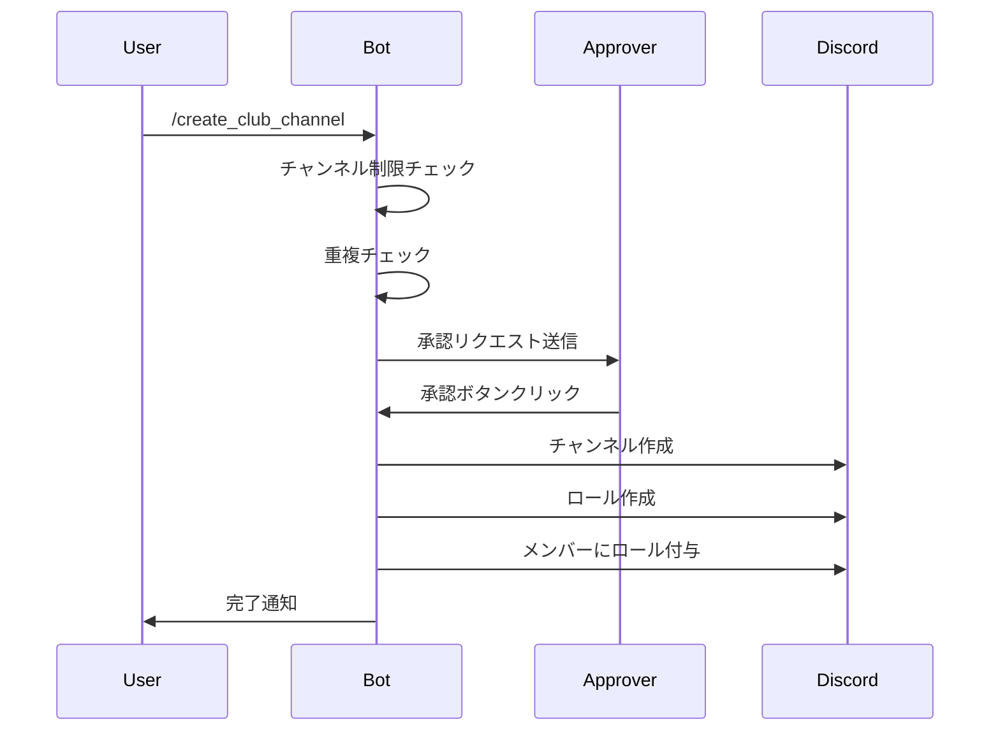

# クラブチャンネル管理システム

## 📖 概要

クラブチャンネル管理システムは、サークルやクラブ活動用のDiscordチャンネルとロールを一元管理する機能です。チャンネル作成時に同名のロールを自動生成し、メンバー管理を簡単に行えます。

### 主な機能

- **チャンネルとロールの一括作成**: 1つのコマンドでチャンネルとロールを同時に作成
- **承認フロー**: 管理者による承認プロセスを経て作成
- **メンバー管理**: 作成時または後からメンバーをロールに追加可能
- **チャンネル制限**: 専用のリクエストチャンネルでのみ実行可能
- **重複チェック**: 同名チャンネルの作成を防止

## 🏗️ アーキテクチャ

### コンポーネント構成

```
src/commands/club_channel.py
├── create_club_channel_impl()      # チャンネル作成実装
├── add_club_role_member_impl()     # ロールメンバー追加実装
└── setup()                         # コマンド登録

src/utils/
├── channel_config.py               # 環境変数管理
├── channel_utils.py                # チャンネルユーティリティ
├── validation_utils.py             # バリデーション
└── message_utils.py                # メッセージヘルパー
```

### 環境変数

`.env` ファイルで以下の変数を設定:

```bash
# クラブチャンネル管理用の設定
CLUB_CATEGORY_NAME="clubs"                    # クラブチャンネルを作成するカテゴリー名
CLUBS_REQUEST_CHANNEL_NAME="club-request"    # リクエストを受け付けるチャンネル名

# 承認システムの設定
APPROVER_ROLE_NAME="Administrator"            # 承認権限を持つロール名
APPROVAL_TIMEOUT_HOURS="24"                   # 承認タイムアウト（時間）
```

## 💡 使い方

### クラブチャンネルの作成

#### 基本的な作成

```
/create_club_channel channel_name:プログラミング部
```

**実行結果:**
- チャンネル: `プログラミング部` (clubsカテゴリ内)
- ロール: `プログラミング部` (メンション可能)

#### メンバー付きで作成

```
/create_club_channel channel_name:ロボット研究会 members:@user1 @user2
```

**実行結果:**
- チャンネル: `ロボット研究会`
- ロール: `ロボット研究会`
- @user1 と @user2 にロールを自動付与

### ロールへのメンバー追加

#### クラブチャンネル内で実行

```
/add_club_role_member members:@user3 @user4
```

実行チャンネル名のロールにメンバーを追加します。

#### 任意の場所で実行

```
/add_club_role_member members:@user3 @user4 role_name:@プログラミング部
```

指定したロールにメンバーを追加します。

## 🔧 実装詳細

### チャンネル作成フロー



### 重複チェックの仕組み

チャンネル作成前に、**clubsカテゴリ内**で同名のチャンネルが存在するかチェックします:

```python
# カテゴリ内に同名のチャンネルが既に存在するかチェック
channel_dict = {ch.name: ch for ch in category_channel.text_channels}
existing_channel = channel_dict.get(formatted_channel_name)
if existing_channel:
    # エラーメッセージを表示して終了
    return
```

**重要なポイント:**
- サーバー全体ではなく、**clubsカテゴリ内のみ**をチェック
- 他のカテゴリに同じ名前があっても作成可能
- ユーザーフレンドリーなエラーメッセージを表示

### ロールメンバー追加の制限

安全性のため、以下の制限があります:

1. **カテゴリチェック**: clubsカテゴリ内のチャンネルに対応するロールのみ操作可能
2. **ロール安全性チェック**: 管理者ロールなど重要なロールは操作不可
3. **チャンネル存在チェック**: ロールに対応するチャンネルが存在する必要がある

```python
# 同名のチャンネルがCLUB_CATEGORY_NAMEカテゴリーに存在するか確認
channel_dict = {ch.name: ch for ch in club_category.text_channels}
club_channel = channel_dict.get(role_name)
if not club_channel:
    # エラー: このロールは操作できません
    return
```

## 📝 コマンド実装例

### create_club_channel コマンド

```python
@command_meta(
    category="クラブチャンネル管理",
    icon="🏛️",
    short_description="クラブ用のチャンネルとロールを作成",
    restrictions="• クラブリクエストチャンネルでのみ実行可能",
    examples=[
        "`/create_club_channel channel_name:プログラミング部`",
        "`/create_club_channel channel_name:ロボット研究会 members:@user1 @user2`",
    ],
)
@tree.command(
    name="create_club_channel",
    description="新しいクラブチャンネルを作成します",
)
@require_channel(channel_name_from_config="clubs_request_channel_name", must_be_in=True)
@require_approval(description="新しいクラブチャンネルを作成します")
@app_commands.describe(
    channel_name="作成するクラブチャンネル名",
    members="ロールに追加するメンバー（メンション形式で複数指定可能。例: @user1 @user2）",
)
async def create_club_channel(
    ctx: discord.Interaction, channel_name: str, members: str | None = None
):
    await create_club_channel_impl(ctx, channel_name, members)
```

**デコレーターの順序（重要）:**
1. `@command_meta()` - メタデータ登録
2. `@tree.command()` - コマンド登録
3. `@require_channel()` - チャンネル制限
4. `@require_approval()` - 承認フロー
5. `@app_commands.describe()` - パラメータ説明

### add_club_role_member コマンド

```python
@command_meta(
    category="ロール管理",
    icon="👥",
    short_description="クラブロールにメンバーを追加",
    restrictions="• 一部ロール以外のみ対象",
    examples=[
        "`/add_club_role_member members:@user1 @user2`",
        "`/add_club_role_member members:@user1 role_name:@プログラミング部`",
    ],
)
@tree.command(
    name="add_club_role_member",
    description="クラブチャンネルに紐づくロールにメンバーを追加します",
)
@app_commands.describe(
    members="追加するメンバー（メンション形式で複数指定可能。例: @user1 @user2）",
    role_name="対象のロール（@ロール形式で指定。例: @プログラミング部 省略時は実行チャンネルのロール）",
)
async def add_club_role_member(
    ctx: discord.Interaction, members: str, role_name: str | None = None
):
    await add_club_role_member_impl(ctx, members, role_name)
```

## 🆚 イベントチャンネルとの比較

| 機能 | イベントチャンネル | クラブチャンネル |
|------|------------------|----------------|
| **チャンネル名** | `e001-ハッカソン` (インデックス付き) | `プログラミング部` (名前のみ) |
| **インデックス管理** | ✅ 自動採番 (3桁0埋め) | ❌ なし |
| **ロール作成** | ✅ | ✅ |
| **メンバー追加** | ✅ | ✅ |
| **承認フロー** | ✅ | ✅ |
| **チャンネル制限** | ✅ event-request | ✅ club-request |
| **アーカイブ機能** | ✅ | ❌ |
| **復元機能** | ✅ | ❌ |
| **重複チェック** | カテゴリ内 | カテゴリ内 |

**設計思想の違い:**
- **イベント**: 一時的な活動、インデックスで管理、アーカイブ可能
- **クラブ**: 恒久的な組織、名前で管理、シンプルな構造

## 🔒 セキュリティとバリデーション

### 実施しているチェック

1. **環境変数の検証**
   ```python
   config = await ChannelConfig.load(ctx)
   if not config:
       return  # エラーメッセージは自動表示
   ```

2. **カテゴリ存在チェック**
   ```python
   category_channel = await validate_category_exists(ctx, guild, config.club_category_name)
   if not category_channel:
       return  # エラーメッセージは自動表示
   ```

3. **重複チェック**
   ```python
   channel_dict = {ch.name: ch for ch in category_channel.text_channels}
   existing_channel = channel_dict.get(formatted_channel_name)
   if existing_channel:
       await send_error_message(ctx, "既に存在します")
       return
   ```

4. **メンバーメンションのパース**
   ```python
   parsed_members = await parse_member_mentions(ctx, members, guild)
   if parsed_members is None:
       return  # エラーメッセージは自動表示
   ```

5. **ロール安全性チェック**
   ```python
   if not await validate_role_safety(ctx, role):
       return  # 管理者ロールなど重要なロールは操作不可
   ```

### エラーハンドリング

```python
try:
    # チャンネル作成処理
    channel = await guild.create_text_channel(...)
    role = await guild.create_role(...)
    # ...
except Exception as e:
    logger.error(f"Error creating club channel: {e}", exc_info=True)
    await handle_command_error(ctx, e, "クラブチャンネルの作成")
```

## 🎯 ベストプラクティス

### 1. チャンネル名の命名規則

**推奨:**
- 簡潔でわかりやすい名前
- 日本語OK（例: `プログラミング部`）
- 英語もOK（例: `programming-club`）

**非推奨:**
- 長すぎる名前（Discordの制限: 100文字）
- 特殊文字の多用
- 既存のチャンネルと紛らわしい名前

### 2. メンバー管理

**作成時に追加:**
```
/create_club_channel channel_name:新入生歓迎会 members:@部長 @副部長
```

**後から追加:**
```
/add_club_role_member members:@新メンバー1 @新メンバー2
```

### 3. エラー対応

**同名チャンネルが存在する場合:**
```
❌ チャンネル `プログラミング部` は既にclubsカテゴリ内に存在します。
   別の名前を使用してください。
```

**対処法:**
- 別の名前を使用する（例: `プログラミング部2024`）
- 既存のチャンネルを確認する

## 🔗 関連ドキュメント

- [APPROVAL.md](./APPROVAL.md) - 承認システムの詳細
- [CHANNEL_RESTRICTION.md](./CHANNEL_RESTRICTION.md) - チャンネル制限の詳細
- [UTILITIES.md](./UTILITIES.md) - ユーティリティ関数の使い方
- [ADD_COMMAND.md](./ADD_COMMAND.md) - 新しいコマンドの追加方法

## 🐛 トラブルシューティング

### Q: 承認リクエストが送信されない

**原因:**
- `CLUBS_REQUEST_CHANNEL_NAME` で指定されたチャンネル以外で実行

**解決策:**
```bash
# .env ファイルを確認
CLUBS_REQUEST_CHANNEL_NAME="club-request"

# 正しいチャンネルで実行
```

### Q: ロールにメンバーを追加できない

**原因:**
1. 対象ロールがclubsカテゴリのチャンネルに対応していない
2. 管理者ロールなど重要なロールを操作しようとしている

**解決策:**
- clubsカテゴリ内のチャンネル名と同じロールを指定
- `/add_club_role_member` は通常のクラブロールのみ操作可能

### Q: 同じ名前のチャンネルが作れない

**これは正常な動作です。**

**理由:**
- 同一カテゴリ内での重複を防ぐため
- ユーザーの混乱を避けるため

**解決策:**
- 年度を付ける（例: `プログラミング部2024`）
- 番号を付ける（例: `プログラミング部2`）
- 既存チャンネルの用途を見直す

## 📚 参考実装

完全な実装は以下のファイルを参照:
- `src/commands/club_channel.py` - メインロジック
- `src/utils/channel_config.py` - 設定管理
- `src/utils/channel_utils.py` - チャンネルユーティリティ
- `src/utils/validation_utils.py` - バリデーション
